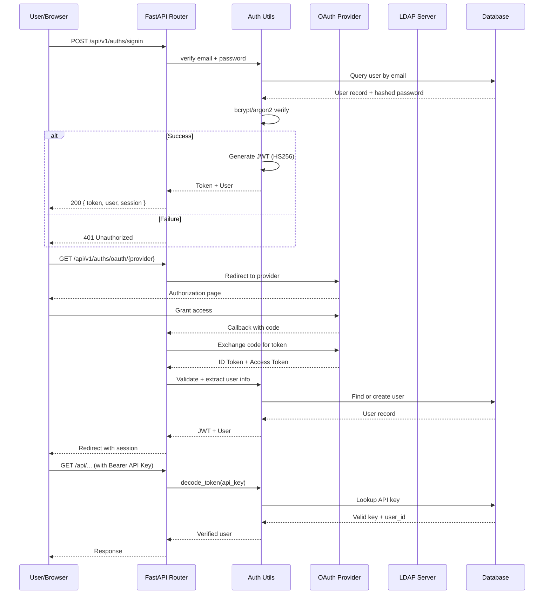
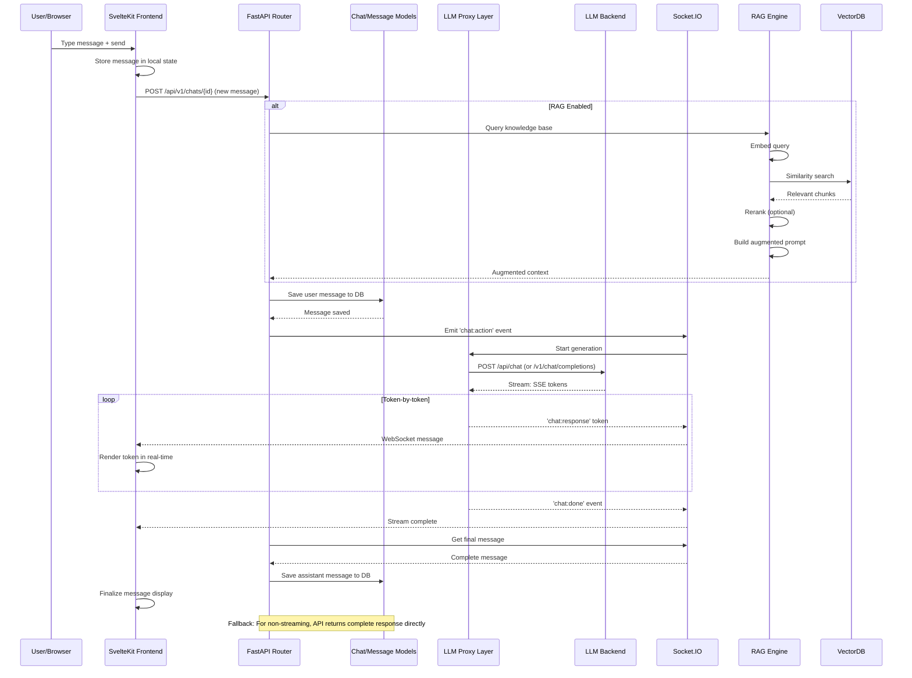
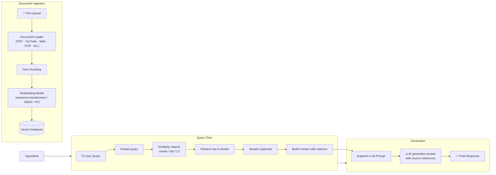
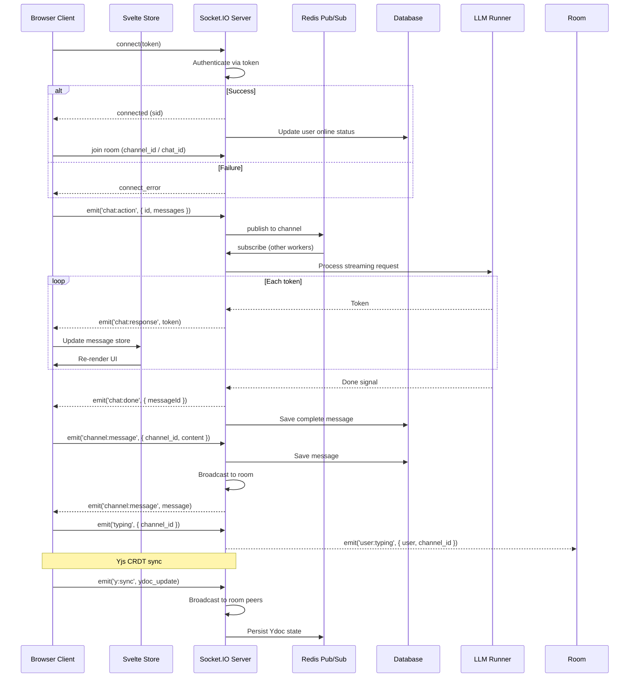
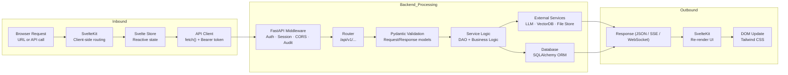

# Open WebUI Architecture Flow

> This document describes the high-level architecture and data flow of Open WebUI.
> Render this file with a Mermaid-compatible viewer to see the diagrams.

---

## 1. High-Level System Architecture

```mermaid
flowchart TB
    subgraph Client["Client Layer"]
        Browser["🌐 Browser / SPA
SvelteKit + Svelte 5"]
        Mobile["📱 Mobile / 3rd Party
HTTP + API Keys"]
    end

    subgraph Backend["FastAPI Backend (Python)"]
        direction TB
        LB["Load Balancer
(optional)"]
        FW["Middleware Stack
CORS · Session · Auth · Audit · Rate Limit"]
        Router["API Router Layer
/api/v1/*"]
        Socket["Socket.IO Server
/ws · Real-time"]
        TaskScheduler["APScheduler
Background Tasks"]
    end

    subgraph Auth["Authentication Layer"]
        JWT["JWT · Bearer Tokens
PyJWT + bcrypt/argon2"]
        OAuth["OAuth 2.0 / OIDC
Google · MS · GitHub · Generic"]
        LDAP["LDAP / AD
ldap3"]
        Trusted["Trusted Header SSO
Reverse-Proxy"]
        SCIM["SCIM 2.0
Okta · Azure AD · Google Workspace"]
    end

    subgraph LLM["LLM Backends"]
        Ollama["🦙 Ollama
Local Models"]
        OpenAI["OpenAI Compatible
OpenAI · Groq · Mistral · OpenRouter"]
        Anthropic["Anthropic
Claude"]
        Gemini["Google Gemini"]
    end

    subgraph RAG["RAG / Retrieval"]
        Loaders["Document Loaders
PDF · YouTube · Web · OCR · ..."]
        Embeddings["Embedding Models
sentence-transformers · ONNX · HF"]
        VectorDB["Vector Databases
Chroma · PGVector · Qdrant · Milvus
Pinecone · ES · OpenSearch · Weaviate · ..."]
        Rerank["Reranking Models"]
    end

    subgraph Storage["Data Storage"]
        DB[("Primary DB
SQLite / PostgreSQL / MySQL")]
        Redis[("Redis
Sessions · Cache · WS Multi-worker")]
        FileStore[("File Storage
Local / S3 / GCS / Azure Blob")]
    end

    subgraph Extra["Integrations & Extensions"]
        Pipelines["Pipelines Plugin System"]
        MCP["MCP Tools (Model Context Protocol)"]
        Pyodide["Pyodide (Python-in-Browser)"]
        WebSearch["Web Search Providers"]
    end

    %% Client → Backend
    Browser --> LB
    Mobile --> LB
    LB --> FW
    FW --> Router
    FW --> Socket

    %% Backend → Auth
    Router --> JWT
    Router --> OAuth
    Router --> LDAP
    Router --> Trusted
    Router --> SCIM

    %% Backend → LLM
    Router --> Ollama
    Router --> OpenAI
    Router --> Anthropic
    Router --> Gemini

    %% Backend → RAG
    Router --> Loaders
    Router --> Embeddings
    Router --> VectorDB
    Router --> Rerank

    %% Backend → Storage
    Router --> DB
    Router --> Redis
    Router --> FileStore
    Socket --> Redis
    TaskScheduler --> DB

    %% Backend → Extra
    Router --> Pipelines
    Router --> MCP
    Router --> WebSearch
    Browser --> Pyodide
```



---

## 2. Authentication Flow



---

## 3. Chat / LLM Request Flow



---

## 4. RAG / Knowledge Retrieval Flow



---

## 5. Real-Time Communication Flow (Socket.IO)



---

## 6. Data Model Relationships

```mermaid
erDiagram
    User ||--o{ Chat : "has many"
    User ||--o{ Auth : "has credentials"
    User ||--o{ Note : "owns"
    User ||--o{ Channel : "creates"
    User }o--o{ Channel : "member of"
    User ||--o{ Group : "member of"
    User ||--o{ ApiKey : "has"
    User ||--o{ Folder : "owns"
    User ||--o{ Prompt : "creates"

    Chat ||--o{ Message : "contains"
    Chat ||--|{ ChatTag : "tagged with"
    Chat }o--|| Folder : "belongs to"

    Message ||--o{ Evaluation : "has feedback"
    Message }o--|| Model : "uses"

    Channel ||--o{ ChannelMessage : "has"
    Channel ||--o{ ChannelAccess : "access control"

    Knowledge ||--o{ KnowledgeItem : "contains"
    Knowledge }o--|| Model : "uses embedding"

    Tool ||--o{ Tool }o--|| User : "created by"
    Function ||--o{ Function }o--|| User : "created by"

    Group ||--o{ GroupUser : "maps"
    Group ||--o{ ChannelAccess : "grants access"

    Automation ||--o{ AutomationAction : "has"
    CalendarEvent ||--o{ User : "belongs to"

    User {
        string id PK
        string name
        string email
        string role "pending | user | admin | default"
        string avatar
    }

    Chat {
        string id PK
        string user_id FK
        string title
        json messages
        timestamp created_at
        timestamp updated_at
    }

    Message {
        string id PK
        string chat_id FK
        string user_id FK
        string role "user | assistant"
        json content
        int timestamp
    }

    Knowledge {
        string id PK
        string name
        string model_id FK
        jsonb data
    }
```

---

## 7. Request Lifecycle (Full-Stack)



---

## 8. Deployment Topology

```mermaid
flowchart TB
    subgraph Single["Single-Server (Default)"]
        direction TB
        FE["SvelteKit Build
Static SPA"]
        BE["FastAPI + Uvicorn
Python Backend"]
        SQLite[("SQLite
webui.db")]
        FileSys[("Local Files")]
        FE --> BE
        BE --> SQLite
        BE --> FileSys
    end

    subgraph Scaled["Scaled Deployment (Redis)"]
        direction TB
        LB2["Load Balancer"]
        FE2["SvelteKit Build
Static SPA (CDN)"]
        BE1["FastAPI Worker 1"]
        BE2["FastAPI Worker 2"]
        BE3["FastAPI Worker N"]
        RedisCluster[("Redis Cluster
Session · Cache · WS") ]
        PG[("PostgreSQL
Primary DB")]
        S3[("S3/GCS/Azure Blob
File Storage")]
        VecDB_Ext[("Vector DB
Chroma / PGVector / Qdrant")]

        LB2 --> FE2
        LB2 --> BE1
        LB2 --> BE2
        LB2 --> BE3
        BE1 --> RedisCluster
        BE2 --> RedisCluster
        BE3 --> RedisCluster
        BE1 --> PG
        BE2 --> PG
        BE3 --> PG
        BE1 --> S3
        BE2 --> S3
        BE3 --> S3
        BE1 --> VecDB_Ext
        BE2 --> VecDB_Ext
        BE3 --> VecDB_Ext
    end
```

---

## 9. Key Data Flows Summary

| #   | Flow                    | Path                                                                        | Protocol         |
| --- | ----------------------- | --------------------------------------------------------------------------- | ---------------- |
| 1   | **User Authentication** | Browser → FastAPI → Auth Utils → DB → JWT                                   | HTTP REST        |
| 2   | **Chat Message**        | Browser → API → Save → LLM Proxy → LLM → Stream back                        | HTTP + WebSocket |
| 3   | **RAG Query**           | Browser → API → Embed → VectorDB → Retrieve → Rerank → Augment Prompt → LLM | HTTP REST        |
| 4   | **File Upload**         | Browser → API → File Store → DB → Embed → VectorDB                          | HTTP Multipart   |
| 5   | **Real-time Chat**      | Browser → Socket.IO → Redis Pub/Sub → Broadcast                             | WebSocket        |
| 6   | **Model Management**    | Browser → API → Ollama/OpenAI API → DB                                      | HTTP REST        |
| 7   | **Admin Config**        | Browser → API → Config Model → DB                                           | HTTP REST        |
| 8   | **Plugin Execution**    | Pipeline Server → FastAPI → External Service                                | HTTP/gRPC        |
